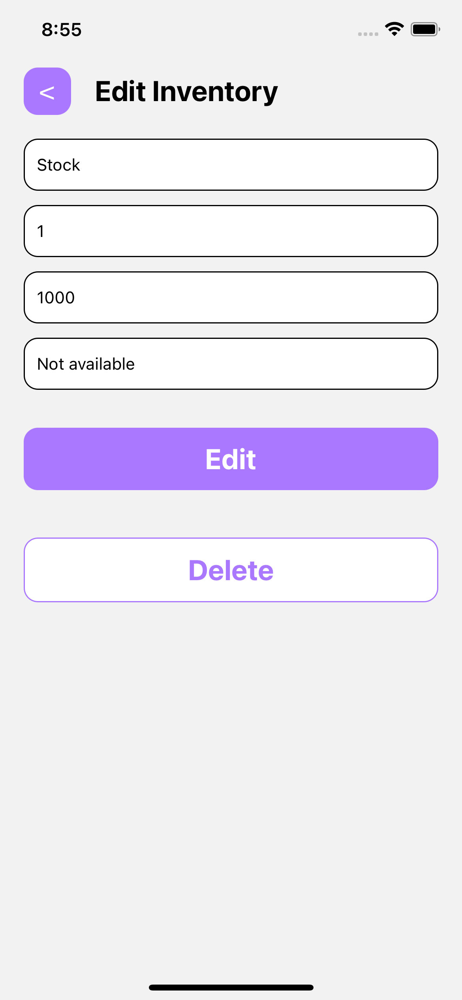

#InventoryManagementApp

This InventoryManagementApp is built with React Native and uses Context Api for state management.

InventoryManagementApp is a mobile app that allows users to list, add, edit, and delete inventory items.

## Screenshots

### Splash and Login

&nbsp;&nbsp;&nbsp;&nbsp;&nbsp;&nbsp;&nbsp;&nbsp;

### Home Empty State and Home with Data

&nbsp;&nbsp;&nbsp;&nbsp;&nbsp;&nbsp;&nbsp;&nbsp;

### Create Inventory and Edit Inventory

&nbsp;&nbsp;&nbsp;&nbsp;&nbsp;&nbsp;&nbsp;&nbsp;

### Modal


## Test locally

To install all dependencies, you need to run the following command:

```bash

git clone https://github.com/lexican/InventoryManagementApp.git
cd InventoryManagementApp

yarn install
npx react-native start
npx react-native run-android

or

npx react-native run-ios

```
